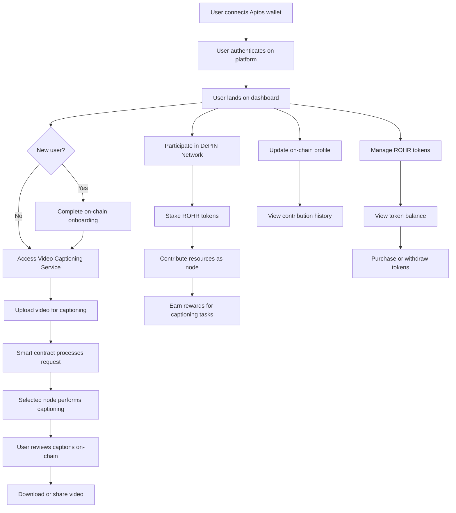

# Crystalrohr: Decentralized Video Captioning on Aptos

[Demo](https://vimeo.com/1007550172?share=copy)

## Overview

Crystalrohr is a decentralized video captioning platform built on the Aptos blockchain using Move language. It leverages a Decentralized Physical Infrastructure Network (DePIN) for node participation and resource contribution. The platform offers automated video captioning services while allowing users to earn tokens by contributing to the network.

## Features

### Video Auto Caption Service

- **Secure Authentication**: Wallet-based login using Aptos accounts.
- **Streamlined Onboarding**: Guided process for new users.
- **Efficient Video Processing**: Upload videos and generate captions using the Aptos-powered backend.
- **Real-time Tracking**: Monitor captioning progress through on-chain events.

### DePIN Network Participation

- **Staking Mechanism**: Stake ROHR tokens to become a network node.
- **Resource Contribution**: Offer computational resources for video captioning.
- **Reward System**: Earn tokens for successful captioning tasks.

### Token Management

- **ROHR Token**: Native fungible asset on Aptos for platform operations.
- **On-chain Transactions**: Purchase, stake, and withdraw tokens seamlessly.

## Technical Architecture

Crystalrohr utilizes three main Move modules:

1. **Protocol**: Manages the core logic for node selection, video submission, and caption completion.
2. **Staking**: Handles token staking for nodes, determining selection probability.
3. **Asset**: Implements the ROHR token as a fungible asset on Aptos.

The platform leverages Aptos's fast finality and robust smart contract capabilities to ensure efficient and secure operations.

## Flow Diagram

## Aptos Integration Highlights

- **Move Language**: Smart contracts written in Move for enhanced security and efficiency.
- **On-chain State Management**: User profiles, staking information, and captioning records stored on Aptos.
- **Event System**: Utilizes Aptos event system for real-time updates on captioning progress and rewards.
- **Randomness Module**: Leverages Aptos's randomness module for fair node selection.
- **Fungible Asset Standard**: ROHR token implemented using Aptos's fungible asset standard.

## Installation

1. `yarn install`
2. `yarn run dev`
3. `look into the move folder for the modules`

## Contributing

We welcome contributions to Crystalrohr! Please feel free to submit issues, fork the repository and send pull requests!

## License

This project is licensed under the [MIT License](LICENSE).